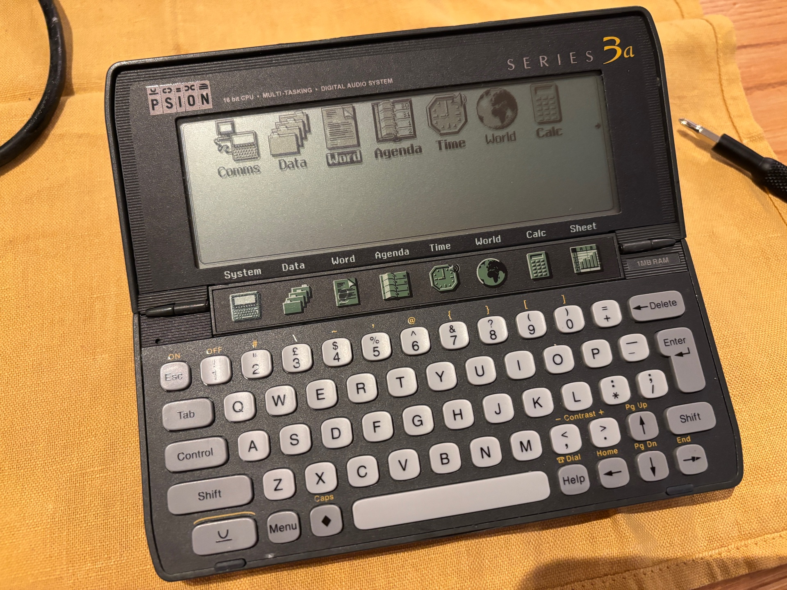

# Word2Text

Convert Psion Series 3, 3a and 3c unencrypted *Word* Documents to Plain Text.

> This utility owes a massive debt to the work of [Clive Feather](https://www.davros.org), whose [Psionics Files](https://www.davros.org/psion/psionics/) contains (among many other useful things) the results of his work reverse engineering the Series 3 applications’ document formats.



## Background

Psion *Word* allows you to enter styled text. Back in the Series 3’s heyday — the mid to late 1990s — Psion provided Windows software that coverted these files to Microsoft Word. A separate DOS utility, *wrd2txt* could convert transferred files to plain text. This latter was the inspiration for *word2text*, which I wrote to perform exactly the same task, but on a modern macOS machine.

I write either plain text or, when I require formatting, in Markdown format. Psion *Word*, created long before Markdown’s conception, doesn’t support it, but both types of text file can be created in *Word* and transferred to a Mac. *Word* embeds the plain text in a document that also includes a host of file, formatting and printing related data. *word2text* strips all that away.

## Usage

Use *word2text* to convert into plain text any Psion *Word* documents that you have transferred to your Mac. Provide a `.WRD` file name as an argument and *word2text* will output a plain text version to stdout. This way you can pipe the result into other command line utilities or redirect output to a file . For example:

```shell
word2text $HOME/Psion/MAGOPUS.WRD > ~/Desktop/MyMagnumOpus.txt
```

If you include the `--file` flag, *word2text* will write the processed text to (using the example above) `MAGOPUS.txt` and not emit it to stdout.

You can also pass a directory name (or a mix of file names and directories), in which case each `.WRD` file in the directory will be converted to a text file in that directory. Files generated this way (or with the `--file` flag) are named after the source file.

```shell
word2text $HOME/Psion
```

```shell
word2text $HOME/Psion $HOME/Desktop/MY_DOC.WRD
```

For convenience, files are written using the UTF-8 encoding.

*word2text* accepts the following modifiers:

* `-m`/`--markdown` — Output the body text in Markdown formatting. Default: `false`.
* `-o`/`--outer` — Include ‘outer’ text, ie. header and footer text, in addition to the body text. Default: `false`.
* `-s`/`--stop` — Stop processing multiple files on the first error. Default: `false`.
* `-f`/`--file` — Output a single input file to a new file. Default: `false`.
* `-v`/`--verbose` — Show file and content discovery information during file processing.

For example:

```shell
word2text $HOME/Psion/BIDDRAFT.WRD
Bid headline
Bid text to go here...
```

```shell
word2text $HOME/Psion/BIDDRAFT.WRD -o
Our Bid for Major Project
-------------------------
Bid headline
Bid text to go here...
-------
Page %P
```

```shell
word2text $HOME/Psion/BIDDRAFT.WRD -m
# Bid headline
Bid text **to go here**...
```

### Markdown

*word2text* can use Word files’ styling information to mark up the processed text with Markdown formatting tags. This is necessarily limited: Word has only two standard headline sizes, and the only empahsis options relevant to Markdown are bold and/or italic text. Where these apply, *word2text* will mark up the text accordingly. Text styled as a Word Bulleted List entry will be tagged as a Markdown unordered list.

For custom styles, *word2text* will apply bold and/or italic emphasis where it can. For custome headlines, *word2text* will apply a Markdown headline size based on the style’s font size.

In due course, I hope to support table formatting from Word tables and ultimately to more intelligently parse custom Word styles.

## Compiling

### macOS

* Clone this repo.
* Open the `.xcodeproj` file.
* Set your team under **Signing & Capabilities** for the *word2text* target.
* Select **Build** from the **Product** menu.

### Linux

* [Install Swift](https://www.swift.org/install/linux/)
* Clone this repo.
* `cd /path/to/repo`
* `swift build`

Binary located in `.build/aarch64-unknown-linux-gnu/debug/`

Copyright © 2025 Tony Smith (@smittytone)
